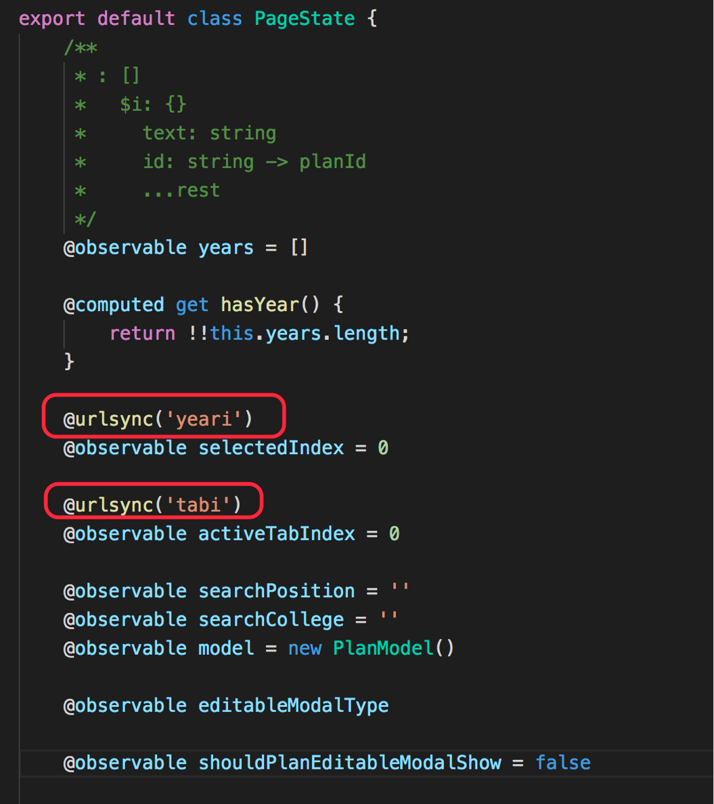
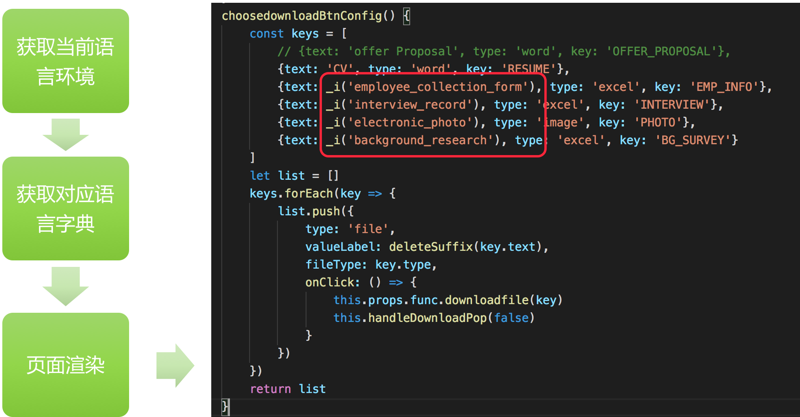
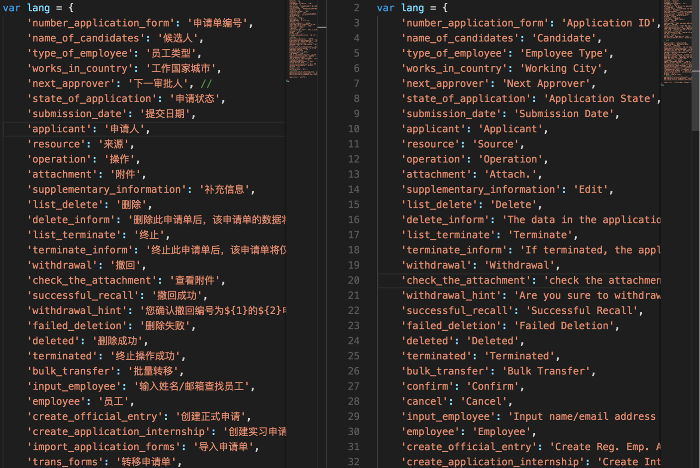
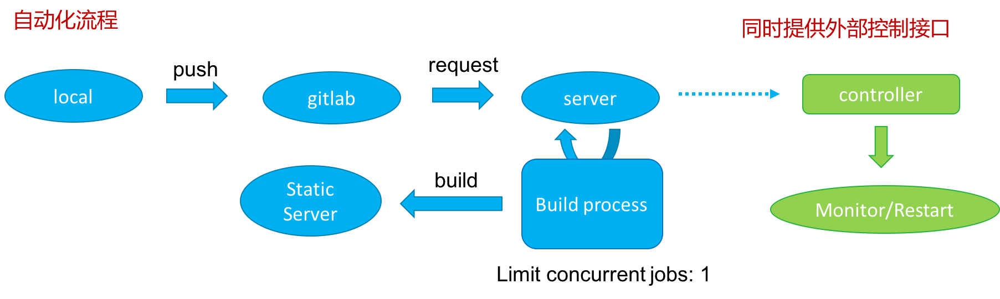
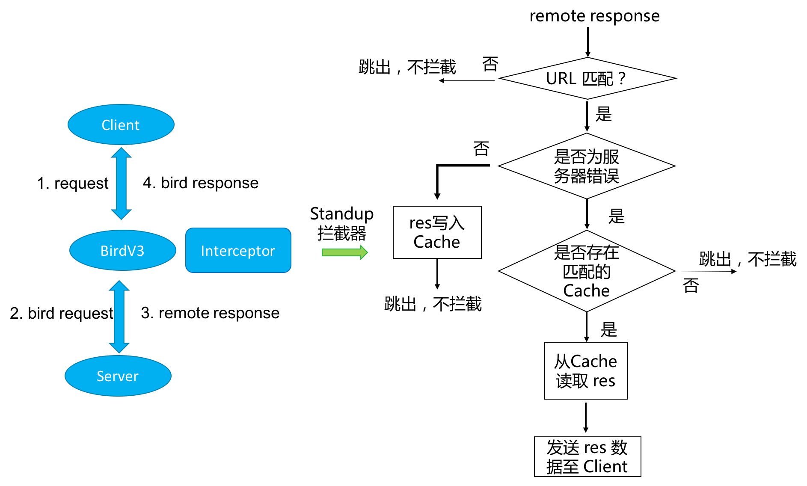

# 述职报告  
- 类型：T3 -> T4  
- 述职人：余聪  
- 时间：2018春季  

# 介绍
本人于2017年7月校招入职百度 BPIT 部门。  
在17年7月至18年1月主要负责 Offer 入职项目的前端开发，未来将进入到 ESOP 项目中。  

# Offer 入职项目
Offer 入职项目从刚入职到17年底才逐渐完工，经常需要加班加点完成开发进度；
下面，我将我在 Offer 入职项目中的工作主要拆分为以下四点：

## 深链方案的提出

### 痛点
团队大部分项目为单页应用，而且大部分项目为 CRUD 交互，表格查询组件居多。  
之前不能维持分页状态数据（包括页码，大小等），刷新页面之后，页面回到初始状态；  

### 效果对比

如下图，在未使用深链方案之前，改变页面状态后，如选择页码后，刷新页面将不会保持页码: 2  
  

在使用了深链方案后，用户之前的页面状态(页码，分页大小)都被保持下来了，效果如图  
  

### 技术实现

原理实现如图：  
  
状态改变的监听基于 Mobx 观察者与被观察者模型实现

### 提升

- 大大提升**用户体验**，只需要复制地址即可回归页面；
- 方案**优雅通用**，适配与团队技术栈  
  只需要在代码中对需要同步的数据，添加 `@urlsync(rename)` 即可
  

## 国际化可视编辑方案提出

### 目前前端国际化方案


图中 `_i(key)` 方法，用于获取当前语言环境下的对应译文

### 痛点
前端接入国际化后，后续国际化文本的维护过程繁琐...  
- FE 纯手工维护国际化字典  
  每一次国际化修改，都是一次苦难；  
  如下图为前端 中、英文字典 片段
  
- 代码定位困难  
  所见文本不是直接对应在代码中


### 效果展示
针对以上痛点，研发出了适配当前国际化方案的：国际化可视编辑。如图：  


### 技术实现
```text
             拦截 translate 方法，注入额外数据
（translate方法：输入 key，输出当前语言环境对应字典中的译文）
                          |
                 视图渲染层（React）拦截
                          |
             检测出是由 translate 输出的结果
                          |
                  高亮 DOM，添加交互逻辑
```

### 提升
1. 节省字典维护成本
2. 方便快速代码定位
3. 暴露可配置的 web 接口，以便后续 RD 接入国际化接口，为PM 直接**线上修改国际化文本**提供可能
4. 该方案**向后兼容**，之前项目可以无缝接入

## 前端资源大小缩减策略
### 问题
1. 前端项目使用 Webpack1 进行构建已做到了多页面管理 + Code Splitting + DLL，但代码级别的缩减工作还需要提升
2. 项目开发的后期，需要将大量 less 文件中的样式引入，手工加上 (reference)，以缩减css大小
3. 前端资源中的 extra html/css/js 资源上线未经过minify处理

### 问题解决
-  开发 [babel-plugin-danger-remove-unused-import](https://github.com/imcuttle/babel-plugin-danger-remove-unused-import)  
    去除未使用到的 import 的 module  
    但其实更应该在 code lint 阶段去处理，但在项目后期再修改 code lint 规则，改动过大

- 开发 [babel-plugin-tiny-import](https://github.com/imcuttle/babel-plugin-tiny-import)  
    细化分割 ES6 module 中的 import  
    基于 ES6 标准实现：
    > ES6 imports are hoisted. (Import 都在代码顶部)   —— ECMA-262 15.2.1.16.4 - 8.a

- 开发 less-reference-import-loader  
    一劳永逸，自动加入 less reference，大幅度减少手工修改工作量

- 使用 copy-webpack-plugin 实现 extra 前端资源的 minify

### 效果对比


针对候选人页面，缩减效果7%，由于项目页面众多，总和起来的缩减效果喜人。  
并且以上方案已经移植到团队的种子工程中，新项目将自动采用以上策略（除 less-reference-import-loader）

## 候选人首页动效开发
  

其中的动画由 U同学提供序列帧（一共有7组），以其中小度晶体一组为例。  
  

U同学提供的序列帧动画有38张，总计6.5M；如果直接使用序列帧来渲染，那么一组动画就需要请求38张图片，而且消耗流量，大大提高服务器负载。  
后考虑使用 gka 工具将序列帧生成一张雪碧图，由原有的 6.5M 缩减为 2.3M，**缩减65%**，大大**降低服务器负载**。  
其中的七组序列帧都做了相似的处理。

## Swagger-UI V1 插件开发

### 痛点
rd 接口文档维护在 swagger-ui 中，但是却没有提供接口搜索的功能，接口查找费时费力。  
### 解决
开发swagger-ui V1插件，提供一个良好的搜索交互，提高效率。  


# 团队贡献
## 组件库Demo发布自动化
使用 webhooks 实现，团队组件 demo 发布的自动化，流程如下：  


## BirdV3 standup 拦截器实现

### 痛点
erp 中 rd 用的编译型语言 Java，每次发版代码都需要重新编译一下，然后才能生效。  
但就是这个编译重新载入的时间，经常会影响我们FE开发，间接地缩减了 FE 的开发时间。  
于是为了解决该问题，基于 BirdV3 的 standup 拦截器应运而生。

### 解决
我们在BirdV3中获取到远端响应的时候，通过一个**拦截器**的概念，如 standup 拦截器，做如下逻辑：  



这样当服务器出错时候，默认认为是 statusCode >= 400，会把最近一次成功的数据返回，这样 FE 本地开发就感受不到远端服务器的崩溃了。

## 项目复盘，沉淀经验与方案
Offer 入职项目完成后，组织进行一次项目复盘，将项目中遇到的问题、经验方案都沉淀下来，让更多的同学收益。

如以上介绍的深链、国际化可视编辑，birdV3 拦截器等均已经融入项目种子工程、工具中。

<!-- ## [**Picidae 文档生成器**](https://github.com/picidaejs/picidaejs)的开发和实践

### 产生背景 & 痛点
以前的书写[组件 Demo](http://origin.eux.baidu.com:8110/demo-v2-picidae)，需要维护:  
1. 组件渲染代码
2. 组件展示代码
3. Demo Case 描述
4. 组件 API

  


其中 1，2 代码应该是一样的，之前却需要维护两份相同的代码；  
而且 4 中的组件 API 需要手工维护  

### Picidae引入后的提升
Picidae引入后，带来的提升是明显的：
1. 所见即所得
  展示代码 == 视图渲染代码，并且支持**在线编辑 Demo，同步渲染**
2. 组件 API 自动生成
  不需要手工维护 API，**API 直接通过分析源码得到**，智能且高效
3. 高度分离我们的 Demo Case，降低耦合度

如下图展示：  


### Picidae的其他实践
还使用 Picidae [重构团队 EUX 博客](https://be-fe.github.io/picidae-theme-eux-blog/)，之前使用 wordpress 搭建，对比如下表：  
| wordpress | picidae |
| --- | --- |
| 传统页面 | 单页应用，体验更佳，使用 React **服务器渲染**兼顾 SEO |
| 需要动态服务器 | 产生页面为静态资源，只需静态服务器 |
| 需要数据库，不易迁移 | 以 markdown 文件作为数据载体，零数据库，易于迁移 |


### Picidae的设计思想

Picidae 提供四种**可拔插**的概念（Transformer、Theme、Plugin、Commander）。  
可拔插的设计思想，可以尽可能的实现高度定制化需求。  


- Transfomer  
  transformer 分为两类：NodeTransformer / BrowserTransformer  
  - 其中 NodeTransformer 分为 MarkdownTransformer 和 HTMLTransformer，分别对 markdown/html 文本进行自定义的转换，得到新的 data（执行环境在node）
  - BrowserTransformer 则为在浏览器环境下执行的转换，其中在浏览器中的 data 为 html 本身。
- Theme  
  自定义开发主题
- Plugin  
  plugin执行在浏览器端，适合于主题开发者，默认注入了 utils plugin
- Commander  
  支持扩展命令行 -->


# 总结 & 产出

## 总结
- 项目开发流程熟悉度提升
- 团队工具，开发模式更清晰了解
- 项目业务沟通能力提升
- 项目进度把控能力学习
- 开发模式的提炼和实践

## 产出
- 丰富团队工具，脚手架
  - BirdV3 中引入拦截器概念，已加入 standup 拦截器
  - 引入 es2015-ie/ie9-polyfill 兼容 ie9
  - 引入一些自主开发的 babel-plugin
  - extra 前端资源 minify
  - doc-pipe：方便同学导入 markdown 至树状文档
- 提供通用可拔插的技术方案，并形成一定使用量
  - 国际化可视化在 HCM-portal 中尝试线上接入
  - 深链方案被运用于offer入职项目其他同学的页面中，并持续在esop项目中使用
- 提高工作效率
  - Swagger-UI 插件提高 FE、RD 同学的接口查阅体验
  - Demo 页发布自动化
  - 调研出一套完备的前端酷炫动效开发方案（gka + createJS）

<!-- - 文档生成工具的开发和使用，优化文档体验，为后续团队文档化进程打下基础 -->

